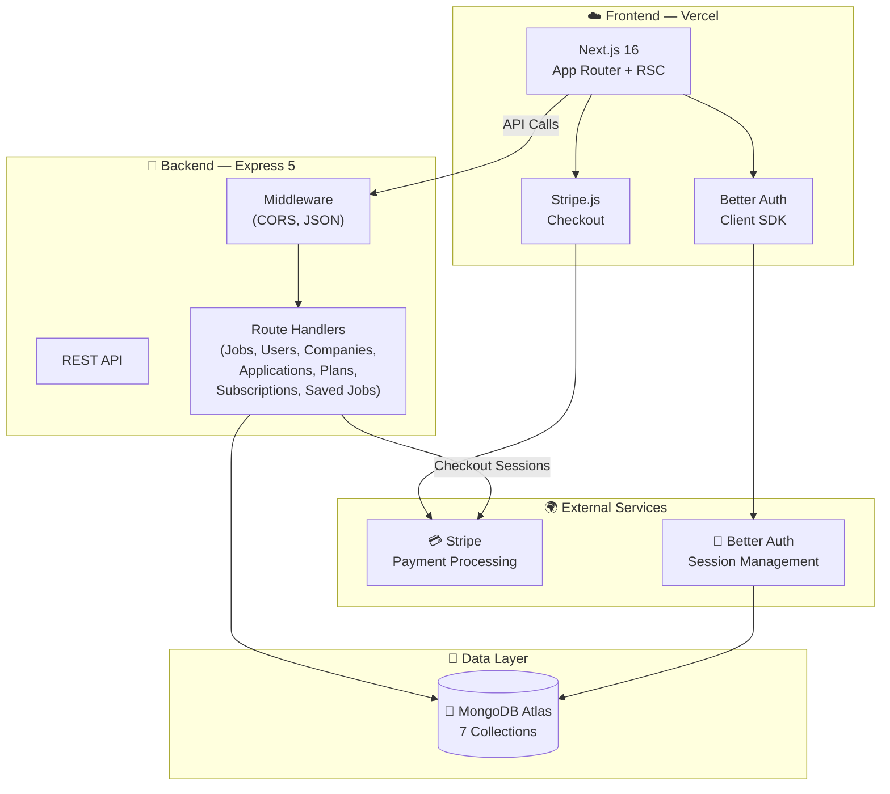

<div align="center">

# 🚀 NextHire

### Hire Elite Talent. Find Your Next Breakthrough.

A **production-grade** job marketplace platform with multi-role authentication, Stripe-powered subscriptions, role-specific dashboards, and a sleek dark-mode UI.

&nbsp;

[](https://nextjs.org/)
[](https://react.dev/)
[](https://tailwindcss.com/)
[](https://www.mongodb.com/)
[](https://stripe.com/)
[](https://expressjs.com/)
[](https://www.better-auth.com/)
[](https://heroui.com/)

&nbsp;

📦 [**Client Repo**](https://github.com/ashiqurrhmn/nextHire-client) &nbsp;·&nbsp; 🔌 [**Server Repo**](https://github.com/ashiqurrhmn/nextHire-server)

</div>

---

## 📖 Table of Contents

- [Overview](#-overview)
- [Why NextHire Stands Out](#-why-nexthire-stands-out)
- [Tech Stack](#-tech-stack)
- [Key Features](#-key-features)
- [Architecture](#-architecture)
- [Project Structure](#-project-structure)
- [Getting Started](#-getting-started)
- [Environment Variables](#-environment-variables)
- [Deployment](#-deployment)
- [Author](#-author)

---

## 🎯 Overview

**NextHire** is a fully-featured job marketplace connecting **Job Seekers**, **Recruiters**, and **Platform Admins** through a modern, responsive web experience. Built with Next.js 16's App Router and React Server Components on the frontend, backed by an Express 5 REST API and MongoDB, it delivers a complete hiring ecosystem — from job discovery and one-click applications to subscription billing and admin oversight.

---

## ✨ Why NextHire Stands Out

| | Feature | Description |
|---|---|---|
| 💳 | **Stripe Subscriptions** | Tiered plans (Free / Pro / Premium for seekers; Free / Growth / Enterprise for recruiters) with Stripe Checkout |
| 🔐 | **Better Auth Integration** | Seamless email/password auth with MongoDB adapter, session management, and role-based field extensions |
| 👥 | **Multi-Role RBAC** | Three distinct roles — Seeker, Recruiter, Admin — each with isolated dashboards and permissions |
| 📊 | **Analytics Dashboards** | Interactive Recharts visualizations: growth trends, application pipelines, company stats, and platform health |
| 🏢 | **Company Approval Workflow** | Recruiters register companies → Admin reviews & approves → Only then can jobs be posted |
| 🎨 | **Dark-Mode Glassmorphism UI** | Premium dark aesthetic with ambient glows, gradient accents, and smooth Framer Motion animations |
| ⚡ | **React Compiler + RSC** | Next.js 16 with React 19, React Compiler enabled, and Server Components for blazing-fast page loads |
| 🔍 | **Smart Job Discovery** | Search by keyword & location, category filters, trending positions auto-derived from live data |

---

## 🔧 Tech Stack

### Frontend

| Technology | Version | Purpose |
|---|---|---|
| **Next.js** | 16 | App Router, React Server Components, API Routes |
| **React** | 19 | UI library with concurrent features + React Compiler |
| **Tailwind CSS** | v4 | Utility-first responsive styling |
| **HeroUI** | 3.x | Accessible, beautiful component library |
| **Framer Motion** | 12.x | Page transitions, hover effects, micro-animations |
| **Better Auth** | 1.6+ | Authentication with MongoDB adapter |
| **Recharts** | 3.x | Interactive data visualization for dashboards |
| **Stripe.js** | 9.x | Client-side Stripe Checkout integration |
| **Gravity UI Icons** | 2.x | Premium icon set |

### Backend

| Technology | Version | Purpose |
|---|---|---|
| **Node.js + Express** | 5.x | High-performance REST API server |
| **MongoDB** | 7.x | NoSQL database via native driver (no ORM overhead) |
| **Stripe SDK** | 22.x | Server-side payment processing & checkout sessions |
| **CORS + Dotenv** | Latest | Middleware and environment configuration |

---

## 🔑 Key Features

### 🔒 Authentication & Authorization
- Email/password registration and sign-in via **Better Auth**
- Role selection at signup: **Seeker** or **Recruiter**
- Admin role management (promote/demote users)
- Secure session handling with MongoDB-backed persistence
- Route protection with role-based redirects

### 🔍 Job Discovery & Browsing
- Full-text search by **keyword**, **location**, and **category**
- Dynamic trending positions derived from live job data
- Detailed job pages with company profiles and apply-in-one-click
- Job saving/bookmarking for seekers
- Smart duplicate application prevention

### 💳 Subscription & Billing
- **6 tiered plans** across both seeker and recruiter roles:
  - *Seeker*: Free (3 apps/mo) → Pro $19/mo (30 apps/mo) → Premium $39/mo (unlimited)
  - *Recruiter*: Free (3 posts) → Growth $49/mo (10 posts) → Enterprise $149/mo (50 posts)
- Stripe Checkout sessions for secure payment processing
- Application limits enforced server-side based on active plan
- Subscription history tracking

### 📊 Role-Specific Dashboards

**🧑‍💼 Seeker Dashboard**
- Application history with status tracking (pending / reviewed / accepted / rejected)
- Saved/bookmarked jobs collection
- Monthly application usage vs. plan limits
- Billing history and subscription management

**🏗️ Recruiter Dashboard**
- Full CRUD for job postings (create, edit, update status)
- Application management with status workflow
- Company registration and profile management
- Analytics: job views, applications over time, conversion metrics
- Revenue & performance charts via Recharts

**🛡️ Admin Dashboard**
- Platform-wide statistics: total users, jobs, active listings
- Company approval/rejection workflow
- User management: role changes, account deletion
- Job moderation: status updates, removal
- Growth analytics: 7-day user & company registration trends
- Subscription & payment oversight

### 💅 UI/UX & Design
- **Dark-mode first** design with `#000` base and zinc surfaces
- Glassmorphic navbar and cards with `backdrop-blur-md`
- Ambient gradient glows with animated orbs (Framer Motion)
- Responsive across all breakpoints (mobile → tablet → desktop)
- Floating search bar with keyword + location inputs
- Loading skeletons for every dashboard page
- Custom 404 and error pages

---

## 🏗️ Architecture



### Database Collections

| Collection | Purpose |
|---|---|
| `user` | User accounts with roles & plan info (managed by Better Auth) |
| `jobs` | Job listings with status, category, company association |
| `companies` | Registered companies with approval status |
| `applications` | Job applications linking seekers to jobs |
| `plans` | Subscription plan definitions (seeded) |
| `subscriptions` | User subscription purchase records |
| `savedJobs` | Bookmarked jobs per user |
| `jobViews` | Analytics: tracks job page views per company |

---

## 📁 Project Structure

```
nextHire-client/
├── src/
│   ├── app/
│   │   ├── api/                    # Next.js API routes
│   │   │   ├── auth/               # Better Auth handler
│   │   │   ├── billing/            # Stripe billing portal
│   │   │   └── checkout_sessions/  # Stripe checkout creation
│   │   ├── auth/                   # Sign-in & Sign-up pages
│   │   │   ├── signin/
│   │   │   └── signup/
│   │   ├── browse-jobs/            # Job catalog + detail pages
│   │   │   └── [id]/               # Dynamic job detail route
│   │   ├── dashboard/
│   │   │   ├── admin/              # Admin dashboard + sub-pages
│   │   │   │   ├── companies/      # Company moderation
│   │   │   │   ├── jobs/           # Job moderation
│   │   │   │   ├── payments/       # Payment oversight
│   │   │   │   └── users/          # User management
│   │   │   ├── recruiter/          # Recruiter dashboard + sub-pages
│   │   │   │   ├── applications/   # Applicant management
│   │   │   │   ├── billing/        # Subscription billing
│   │   │   │   ├── company/        # Company profile
│   │   │   │   ├── jobs/           # Job CRUD (new, edit)
│   │   │   │   └── settings/       # Account settings
│   │   │   └── seeker/             # Seeker dashboard + sub-pages
│   │   │       ├── applications/   # My applications
│   │   │       ├── billing/        # Subscription billing
│   │   │       ├── saved-jobs/     # Bookmarked jobs
│   │   │       └── settings/       # Account settings
│   │   ├── pricing/                # Pricing page
│   │   ├── unauthorized/           # 403 redirect page
│   │   ├── layout.js               # Root layout (Geist fonts, dark mode)
│   │   ├── page.js                 # Landing page
│   │   ├── not-found.jsx           # Custom 404
│   │   └── error.jsx               # Error boundary
│   ├── components/
│   │   ├── dashboard/              # Dashboard-specific components
│   │   │   ├── AdminDashboardCharts.jsx
│   │   │   ├── DashboardCharts.jsx
│   │   │   ├── DashboardHeader.jsx
│   │   │   ├── DashboardSideBar.jsx
│   │   │   ├── RecentApplications.jsx
│   │   │   ├── StatsSection.jsx
│   │   │   └── TopCompanies.jsx
│   │   ├── Banner.jsx              # Hero section with search
│   │   ├── CallToAction.jsx        # CTA section
│   │   ├── FeaturedJobs.jsx        # Featured job listings
│   │   ├── Footer.jsx              # Site footer
│   │   ├── HowItWorks.jsx          # Process explanation
│   │   ├── JobCard.jsx             # Reusable job card
│   │   ├── ApplyModal.jsx          # Job application modal
│   │   ├── Navbar.jsx              # Glassmorphic navigation
│   │   ├── Pricing.jsx             # Pricing plans component
│   │   ├── Stats.jsx               # Platform statistics
│   │   └── TopCompanies.jsx        # Top companies showcase
│   └── lib/
│       ├── actions/                # Server actions
│       │   ├── applications.js
│       │   ├── companies.js
│       │   ├── jobs.js
│       │   └── subscription.js
│       ├── api/                    # API client functions
│       │   ├── applications.js
│       │   ├── companies.js
│       │   ├── jobs.js
│       │   ├── plans.js
│       │   ├── saved-jobs.js
│       │   └── subscriptions.js
│       ├── auth.js                 # Better Auth server config
│       ├── auth-client.js          # Better Auth client hooks
│       └── stripe.js               # Stripe config + price IDs
├── public/
│   └── Assets/                     # Logo and static assets
├── next.config.mjs                 # React Compiler enabled
├── tailwind.config / postcss       # Tailwind v4 setup
└── package.json
```

```
nextHire-server/
├── index.js                        # Express 5 API (all routes)
├── seed-plans.js                   # Database seeder for plans
├── package.json
└── .env                            # Environment variables
```

---

## 🚀 Getting Started

### Prerequisites

- **Node.js** v18+ (v22 recommended)
- **MongoDB** cluster ([MongoDB Atlas](https://www.mongodb.com/atlas) recommended)
- **Stripe Account** with API keys ([stripe.com](https://stripe.com))

### Installation

```bash
# ── 1. Clone both repositories ──────────────────────────────

git clone https://github.com/ashiqurrhmn/nextHire-client.git
git clone https://github.com/ashiqurrhmn/nextHire-server.git

# ── 2. Set up the Backend ───────────────────────────────────

cd nextHire-server
npm install

# Create .env file (see Environment Variables section below)

# Seed subscription plans into MongoDB
node seed-plans.js

# Start the server
npm start
# → Server runs on http://localhost:5000

# ── 3. Set up the Frontend ──────────────────────────────────

cd ../nextHire-client
npm install

# Create .env file (see Environment Variables section below)

# Start development server
npm run dev
# → Frontend runs on http://localhost:3000
```

---

## 🔐 Environment Variables

### Frontend (`nextHire-client/.env`)

```env
# MongoDB connection (used by Better Auth)
MONGODB_URI=mongodb+srv://<user>:<password>@<cluster>.mongodb.net
AUTH_DB_NAME=dbname

# Better Auth
BETTER_AUTH_SECRET=your-secret-key
BETTER_AUTH_URL=http://localhost:3000

# Backend API URL
NEXT_PUBLIC_BASE_URL=http://localhost:5000

# Stripe
STRIPE_SECRET_KEY=sk_test_...
NEXT_PUBLIC_STRIPE_PUBLISHABLE_KEY=pk_test_...
```

### Backend (`nextHire-server/.env`)

```env
# MongoDB
MONGODB_URI=mongodb+srv://<user>:<password>@<cluster>.mongodb.net
DB_NAME=dbname

# CORS
CLIENT_URL=http://localhost:3000

# Server
PORT=5000
```

---

## 🌐 Deployment

| Service | Purpose | Details |
|---|---|---|
| **Vercel** | Next.js Frontend | Auto-deploy from GitHub, edge-optimized |
| **Node.js Hosting** | Express API Server | Any Node.js host (Render, Railway, VPS) |
| **MongoDB Atlas** | Database | Cloud-hosted NoSQL with free tier |
| **Stripe** | Payments | Test mode for development, live keys for production |

### Deploy Frontend to Vercel

```bash
# Install Vercel CLI
npm i -g vercel

# Deploy
vercel --prod
```

> **Note**: Set all frontend environment variables in the Vercel dashboard under **Settings → Environment Variables**.

---

## 🗺️ API Endpoints Reference

| Method | Endpoint | Description |
|---|---|---|
| `GET` | `/api/users` | List all users (filterable by role) |
| `PATCH` | `/api/users/:id/role` | Update user role (Admin) |
| `DELETE` | `/api/users/:id` | Delete a user (Admin) |
| `GET` | `/api/jobs` | List jobs (filterable by company, status) |
| `GET` | `/api/jobs/:id` | Get single job details |
| `POST` | `/api/jobs` | Create new job (requires approved company) |
| `PUT` | `/api/jobs/:id` | Update a job listing |
| `PATCH` | `/api/jobs/:id/status` | Update job status (Admin) |
| `DELETE` | `/api/jobs/:id` | Delete a job (Admin) |
| `POST` | `/api/jobs/:id/views` | Record a job view |
| `GET` | `/api/job-views` | Get job views per company |
| `POST` | `/api/applications` | Submit application (plan-limited) |
| `GET` | `/api/applications` | List applications (filterable) |
| `PATCH` | `/api/applications/:id/status` | Update application status |
| `GET` | `/api/applications/check` | Check if user applied to job |
| `GET` | `/api/applications/my` | Get user's application summary |
| `POST` | `/api/companies` | Register a new company |
| `GET` | `/api/companies` | List companies (filterable) |
| `GET` | `/api/companies/:id` | Get company details |
| `PATCH` | `/api/companies/:id/status` | Approve/reject company (Admin) |
| `GET` | `/api/plans` | Get subscription plans |
| `POST` | `/api/subscriptions` | Create subscription record |
| `GET` | `/api/subscriptions` | Get user subscriptions |
| `POST` | `/api/saved-jobs` | Toggle save/unsave a job |
| `GET` | `/api/saved-jobs` | Get saved jobs with full details |
| `GET` | `/api/saved-jobs/ids` | Get saved job IDs only |

---

## 👤 Author

<div align="center">

**Built with 🔥 by [Md. Ashiqur Rahman](https://ashiqur-portfolio0.vercel.app/)**

&nbsp;

[](https://ashiqur-portfolio0.vercel.app/)
[](https://github.com/ashiqurrhmn)
[](https://www.linkedin.com/in/ashiqur-rahman00/)
[](mailto:ashiqur1312@gmail.com)

</div>

---

<div align="center">

### ⭐ If you found this helpful, give it a star!

**Built with ❤️ using Next.js 16, Express 5, MongoDB, and Stripe**

&nbsp;

[](https://github.com/ashiqurrhmn/nextHire-client)
[](https://github.com/ashiqurrhmn/nextHire-server)

&nbsp;

<sub>© 2026 NextHire. All rights reserved.</sub>

</div>
